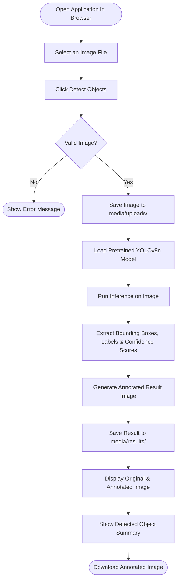
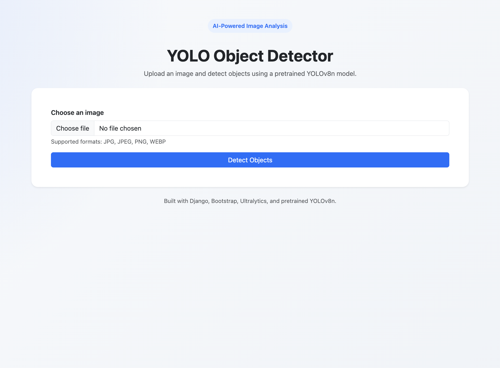
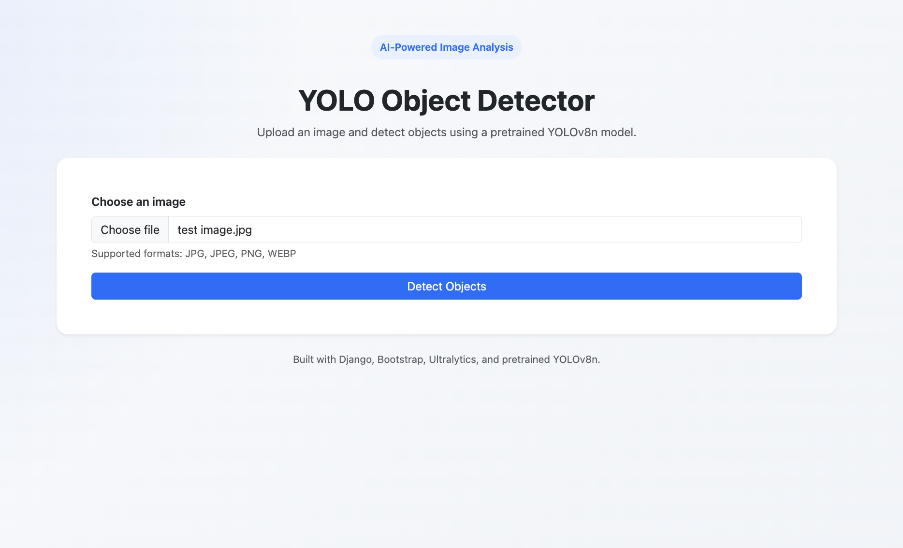
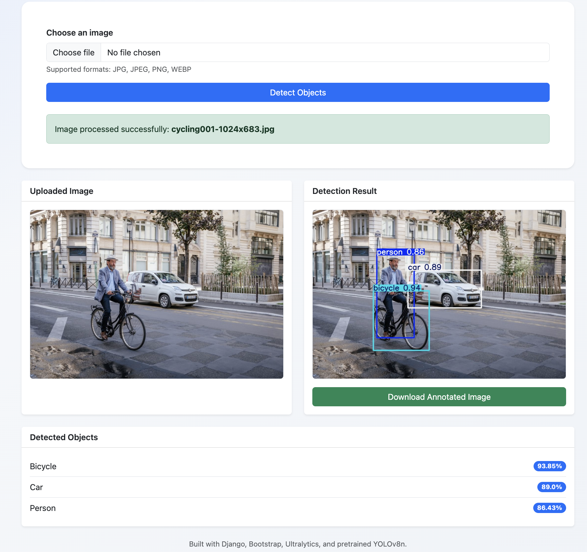
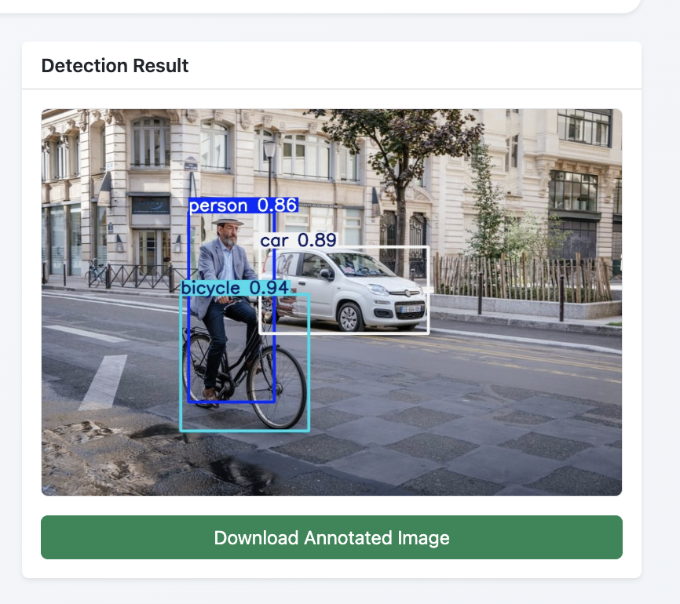

<h1 align="center">YOLO Object Detector</h1>

A Django-based AI-integrated web application that allows users to upload an image and receive an annotated object detection result using a pretrained YOLOv8n model.

---

## Overview

YOLO Object Detector is a simple web-based object detection application built with Django. Users can upload an image through a clean web interface, and the backend processes the image using the pretrained YOLOv8n model from Ultralytics.

The application returns an annotated image containing detected objects, bounding boxes, class labels, and confidence scores. It also provides a detected object summary and an option to download the annotated result image.

This project is intentionally kept simple and focused on the core AI inference pipeline without unnecessary over-engineering.

---
 
## User Flow
 

 
---

## Features

- Upload image through a web interface
- Validate image file type and actual image content
- Run object detection using pretrained YOLOv8n
- Display uploaded image preview
- Display annotated detection result
- Show detected object labels and confidence scores
- Download annotated result image
- Handle invalid files and inference errors gracefully
- Clean responsive UI using Bootstrap and custom CSS

---

## Tech Stack

- Python
- Django
- HTML
- Bootstrap
- CSS
- Ultralytics YOLOv8n
- PyTorch
- Pillow
- Git and GitHub

---

## Project Structure

```text
yolo_object_detector/
│
├── detector/
│   ├── static/
│   │   └── detector/
│   │       └── css/
│   │           └── style.css
│   ├── templates/
│   │   └── detector/
│   │       └── index.html
│   ├── urls.py
│   ├── utils.py
│   └── views.py
│
├── detector_project/
│   ├── settings.py
│   ├── urls.py
│   ├── asgi.py
│   └── wsgi.py
│
├── media/
│   ├── uploads/
│   └── results/
│
├── screenshots/
│   ├── homepage.png
│   ├── upload-selected.png
│   ├── detection-result.png
│   └── download-button.png
│
├── manage.py
├── requirements.txt
├── .gitignore
└── README.md
```

---

## Installation and Setup

Follow these steps to run the project locally on macOS, Linux, or Windows.

### 1. Clone the repository

```bash
git clone https://github.com/alaminpiyal2002/yolo_object_detector.git
cd yolo_object_detector
```

### 2. Create a virtual environment

**macOS / Linux:**

```bash
python3 -m venv venv
```

**Windows:**

```bash
python -m venv venv
```

### 3. Activate the virtual environment

**macOS / Linux:**

```bash
source venv/bin/activate
```

**Windows Command Prompt:**

```bash
venv\Scripts\activate
```

**Windows PowerShell:**

```bash
venv\Scripts\Activate.ps1
```

### 4. Install dependencies

```bash
pip install -r requirements.txt
```

### 5. Run the Django development server

```bash
python manage.py runserver
```

### 6. Open the application

Visit the following URL in your browser:

```
http://127.0.0.1:8000/
```

> **Note:** On the first inference run, Ultralytics may automatically download the `yolov8n.pt` model weight file.

---

## Usage

1. Open the application in the browser.
2. Choose an image file.
3. Click **Detect Objects**.
4. View the uploaded image preview.
5. View the annotated detection result.
6. Check detected object labels and confidence scores.
7. Download the annotated image if needed.

---

## Inference Pipeline

The object detection pipeline follows these steps:

1. **Image Upload**
   The user uploads an image through the Django web interface.

2. **Validation**
   The application checks the file extension and verifies that the uploaded file is a valid image using Pillow.

3. **Image Storage**
   The uploaded image is saved inside the `media/uploads/` directory.

4. **Model Loading**
   The pretrained YOLOv8n model is loaded once using the Ultralytics library — not on every request — to improve performance.

5. **Inference**
   The saved image path is passed to YOLOv8n for object detection.

6. **Post-processing**
   The model returns detected object classes, confidence scores, and bounding boxes.

7. **Output Generation**
   An annotated image is generated and saved inside the `media/results/` directory.

8. **Result Display**
   The Django template displays the uploaded image, annotated result image, detected object list, and download option.

---

## Screenshots

### Homepage



### Image Upload Selected



### Detection Result



### Download Annotated Image



---

## Design Decisions

1. **Django was used as the backend framework** because it is allowed by the assignment and provides fast development with built-in routing, templates, and file handling.

2. **Simple Django templates were used instead of React or Next.js** to avoid over-engineering and keep the application focused on the AI inference pipeline.

3. **YOLOv8n pretrained model was selected** because the assignment specifically requires a pretrained YOLOv8n model and it is lightweight enough for local inference.

4. **The model is loaded once** (not inside every request) to improve performance — the model does not need to be reloaded each time a user uploads an image.

5. **Uploaded images and result images are stored separately** in `media/uploads/` and `media/results/` for better organization.

6. **Bootstrap and small custom CSS were used** to create a clean and professional UI without adding frontend complexity.

7. **A confidence threshold is used** to reduce low-confidence false detections.

8. **The application focuses on single-image object detection** because that is the core requirement of the assignment.

---

## Limitations

- The application currently supports image upload only.
- Video inference is not implemented.
- The model is pretrained and not custom-trained.
- Detection accuracy depends on the pretrained YOLOv8n model.
- Some unsupported or visually ambiguous objects may be incorrectly classified.
- Uploaded and processed files are stored locally.
- No user authentication or database-backed history is included.
- The project is designed as a technical assignment MVP, not a full production system.

---

## Future Improvements

- Add confidence threshold control in the UI
- Add support for video inference
- Add cleanup for old uploaded and result images
- Add Docker support
- Add API endpoint for inference
- Add cloud deployment support
- Improve logging and monitoring
- Add database-backed detection history

---

## Author

**Al Amin**

Email: [alamin876123@gmail.com](mailto:alamin876123@gmail.com)

GitHub: [https://github.com/alaminpiyal2002](https://github.com/alaminpiyal2002)